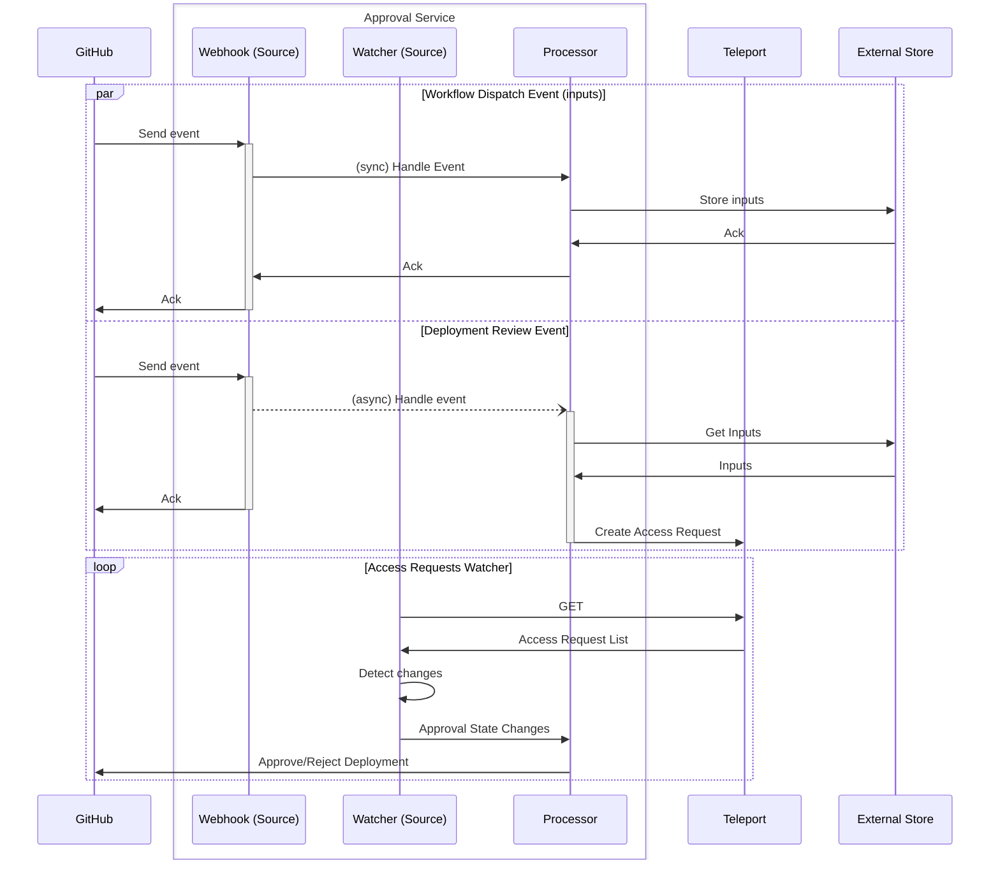
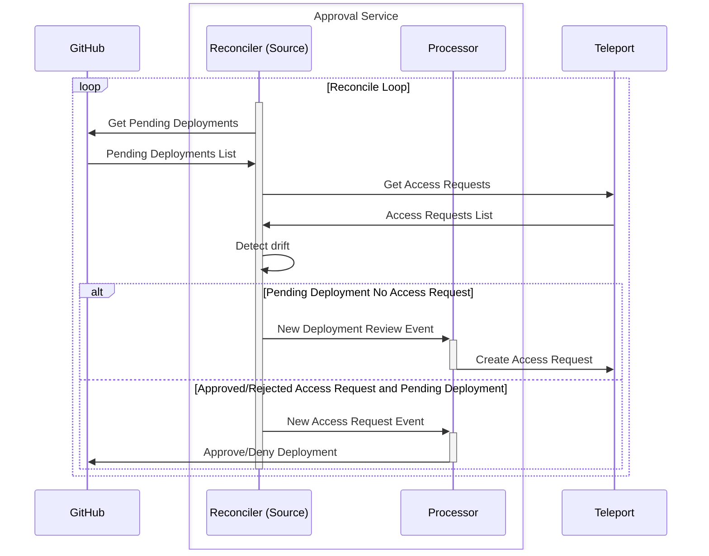

# approval-service

This service approves or denies CI/CD pipeline jobs. Approvals/denials are
handled by Teleport.

It currently supports:
* [GitHub Deployment Protection Rules](https://docs.github.com/en/webhooks/webhook-events-and-payloads#deployment_protection_rule)

## Prerequisites

These are steps that are done before provisioning and deployment

### GitHub App

A GitHub App must be created and installed to the repositories you want the tool to manage.
This will give us credentials necessary to authenticate to approve deployment reviews and also allows 

**Repository Permissions**:

* Deployments: Read and write

**Subscribe to events**:

* Deployment review: Deployment review requested, approved or rejected.

### Branch Protection Rules

Once the GitHub App is installed to a repository, the branch protection rules must also be configured to allow for the service 
to approve/deny deployments.

This can be done by navigating to `Settings > Environments > <Environment to configure>`

A checkbox will be present with the name of the App. Ensure this is checked and click on the `Save Protection Rules` button.

## Provisioning

This should be done after prerequisites are completed.
Provisioning contains configuration that is typically not tied to the development lifecycle of the service.
For example certificate, DNS, Security Groups, etc

TODO: This will be added in a follow up PR

## Deployment

This should be done after provisioning is completed.
Deployment contains configuration that is more closely related to the lifecycle of the service.
Iteration and version updates to the app are likely to require changes to these configurations.

TODO: This will be added in a follow up PR.

## Architecture

The following diagram shows a sequence diagram for the flow of state in the "happy path" scenario.

An important property of the service is that:
* Deployment Review Event should always return a successful response immediately and handle the processing asynchronously.
* Webhook Dispatch Event will process synchronously and return a successful response when the inputs are successfully stored.

There are some reasons for this decision:
* A failure for a Deployment Review Event can be easily recovered by querying for pending deployments on the repo.
* A failure to procesess a Webhook Dispatch Event requires the event to be resent.
* Considering the above, when a failed event is observed it is likely that it is a Webhook Dispatch Event.

### Reconcile

When a workflow is started, GitHub will send upwards of 100 Deployment Review Events for that workflow. We certainly don't want to deal with upwards of 100 Access Requests created in Teleport so we have some coordination logic in place to prevent this. However, the timing of these events is inconsistent and slowness and failures could interrupt the normal flow of the service causing drift in expected state.

The service has some reconcile logic that serves as a redundancy for the potential failure of the Deployment Review Event.

